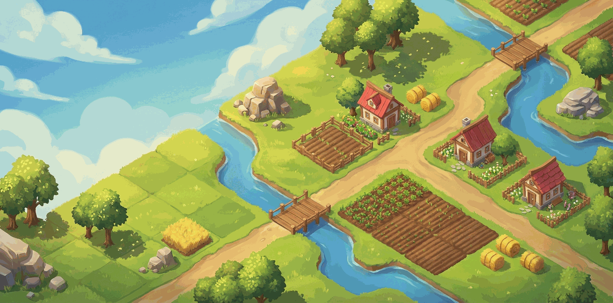
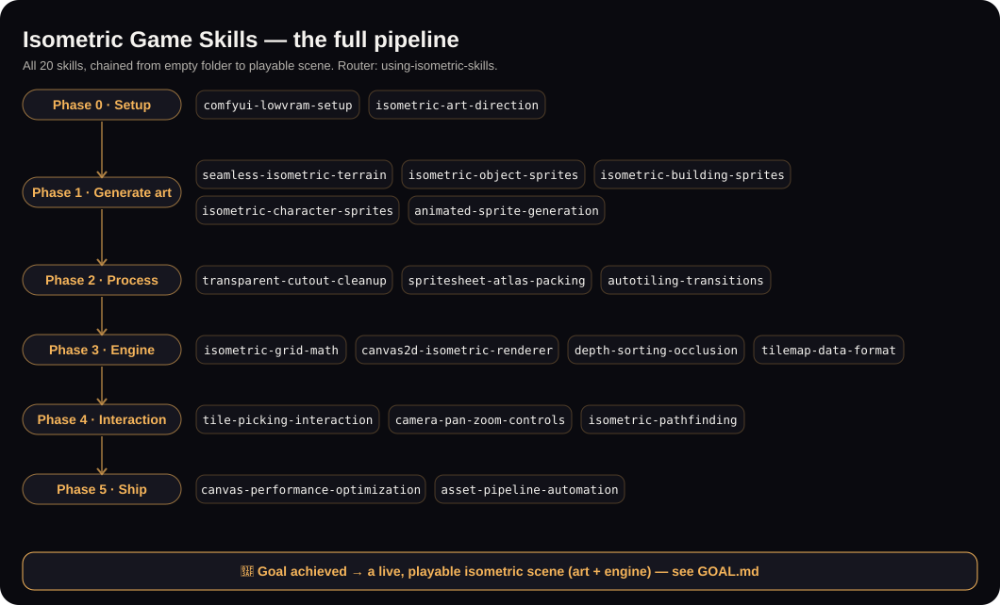
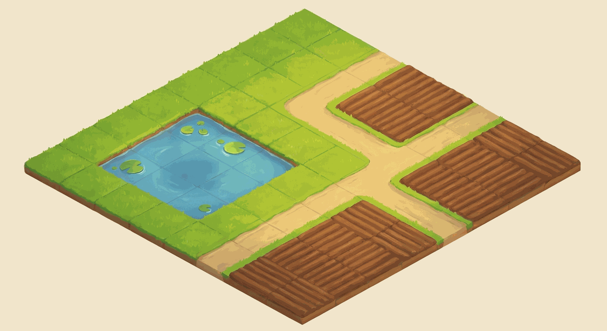
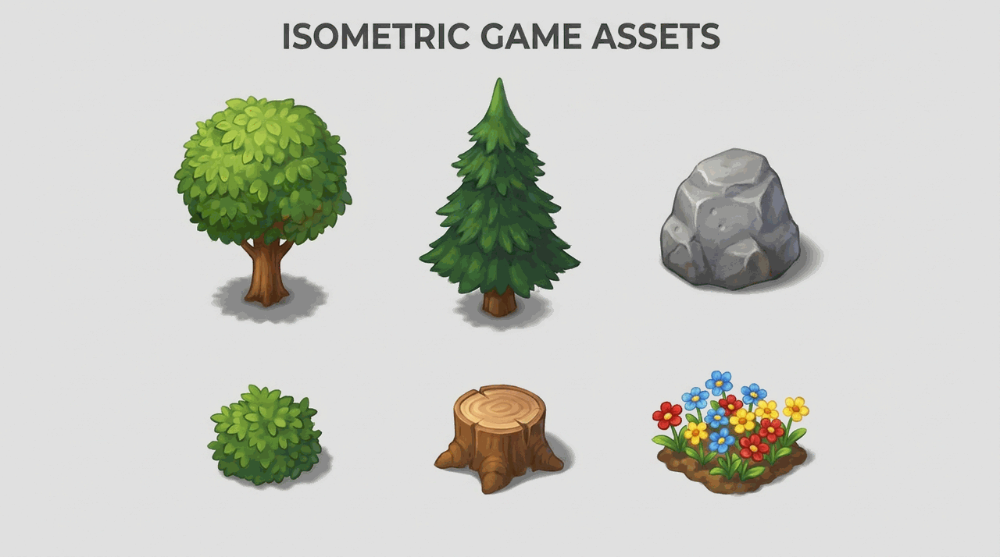
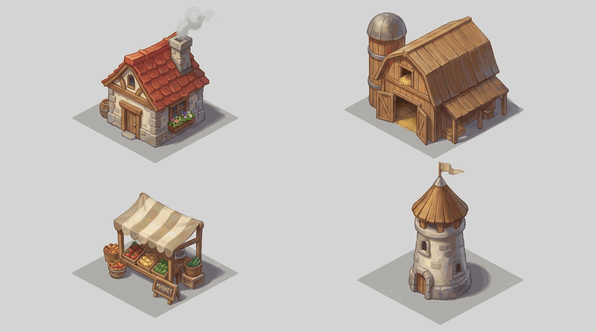
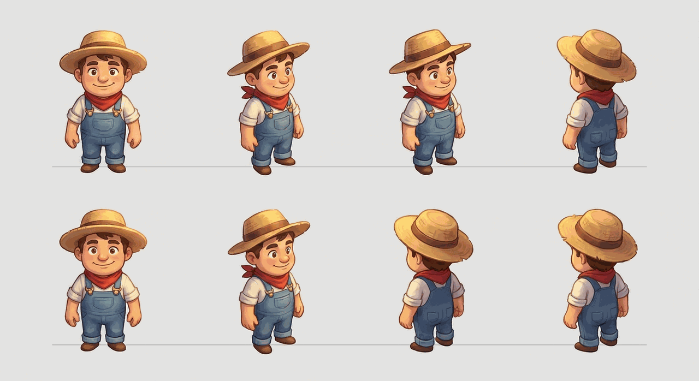
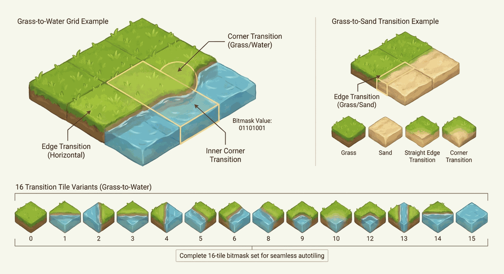

<div align="center">

# 🏔️ Isometric Game Agent Skills

**Production-grade AI agent skills for building isometric games — from AI-generated art to the rendering engine.**

The missing toolkit that teaches AI coding agents how senior game artists and engine programmers actually build isometric worlds: seamless tiles, depth-sorted sprites, grid math, and the whole asset pipeline.

       [](https://0xheycat.github.io/isometric-game-skills/demo/) [](https://0xheycat.xyz/work/isometric-game-skills)

[Quick Start](#-quick-start) · [Live Demo](#-live-demo) · [The Skills](#-the-skill-collection) · [Gallery](#-gallery) · [How Skills Work](#-how-skills-work) · [Contributing](#-contributing) · [Roadmap](#-roadmap)



</div>

---

## Why this exists

AI coding agents are great at React and terrible at isometric games. They generate tiles that do not align, sprites in 5 different styles, characters that render behind walls, and renderers that drop to 12fps. Not because the models are weak — because nobody wrote down **how an experienced isometric dev actually works**.

This repo is that knowledge, encoded as **SKILL.md** files an agent can load on demand. Point Claude Code, Cursor, or Codex at it and your agent suddenly builds isometric worlds like it has shipped three of them.

> New here? Start with the meta-skill **[using-isometric-skills](skills/using-isometric-skills/SKILL.md)** — it routes any incoming task to the right workflow.

## 🚀 Quick Start

```bash
git clone https://github.com/0xheycat/isometric-game-skills.git
```

Then wire it into your agent (pick your tool):

| Tool | How to install |
|---|---|
| **Claude Code** | Copy any `skills/<name>/` folder into `.claude/skills/` in your project. |
| **Cursor** | See [`docs/cursor-setup.md`](docs/cursor-setup.md) — add the skill body to project rules. |
| **Codex / other** | Paste the relevant `SKILL.md` into your agent's context or skills folder. |

Full walkthrough: [`docs/getting-started.md`](docs/getting-started.md).

## 🎮 Live Demo

**▶️ [Play it live in your browser](https://0xheycat.github.io/isometric-game-skills/demo/)** — hosted on GitHub Pages, no install. Drag to pan, scroll to zoom, toggle 🖼️ Sprites.

A single-file, dependency-free Canvas2D isometric renderer lives in [`demo/`](demo/) — **proof these skills are real, not theory**. Procedural terrain, depth-sorted objects, tile picking, and a pan/zoom camera, all in one HTML file.

```bash
python3 -m http.server 8080   # then open http://localhost:8080/demo/
```

It directly exercises six skills: `isometric-grid-math`, `canvas2d-isometric-renderer`, `depth-sorting-occlusion`, `tilemap-data-format`, `tile-picking-interaction`, and `camera-pan-zoom-controls`. See [`demo/README.md`](demo/README.md).

> Want the same world with painterly sprites instead of flat blocks? Swap in assets from the generation skills + [`spritesheet-atlas-packing`](skills/spritesheet-atlas-packing/SKILL.md).

<!-- Maintainer note: set the GitHub social card under Settings → Social preview using assets/social-preview.png (1280×640). -->

## 🗺️ How it all fits together

These aren't 20 loose tips — they chain into one pipeline that takes an agent from an empty folder to a **playable isometric scene**. Proof, not theory.



- 🎯 **[GOAL.md](GOAL.md)** — the measurable Definition of Done. When every box is checked, the goal is *achieved*.
- 🏗️ **[docs/build-a-game.md](docs/build-a-game.md)** — the capstone walkthrough that runs **all 20 skills** in order, with an acceptance test per phase.
- ✅ **[`scripts/validate_skills.py`](scripts/validate_skills.py)** — CI-enforced check that every `SKILL.md` is well-formed (the `skills valid` badge above). Machine-readable index: [`skills.json`](skills.json).
- 🧮 **[`engine/iso.js`](engine/iso.js)** — the canonical 2:1 iso math (grid↔screen, picking, depth sort) with **passing unit tests** ([`engine/iso.test.mjs`](engine/iso.test.mjs), run in CI). The math is *tested*, not asserted.
- 🗂️ **[`examples/sample-map.json`](examples/sample-map.json)** — a hand-authored map in the `tilemap-data-format`. Render it headless with [`examples/render-map.mjs`](examples/render-map.mjs) → [`sample-map.svg`](examples/sample-map.svg) (drawn by the tested engine, no browser).

## 🧩 The Skill Collection

**21 skills** covering the full isometric game pipeline, grouped by phase. Run them in order, or load just the one you need.

### 🧭 Meta
| Skill | What it does |
|---|---|
| [using-isometric-skills](skills/using-isometric-skills/SKILL.md) | Router — maps any task to the right skill, in the right order. |

### 🎨 Art Foundations
| Skill | What it does |
|---|---|
| [comfyui-lowvram-setup](skills/comfyui-lowvram-setup/SKILL.md) | Reproducible SDXL setup that never OOMs on a 12GB GPU. |
| [isometric-art-direction](skills/isometric-art-direction/SKILL.md) | Lock ONE style sheet so 200 assets look like one game. |

### 🖼️ Asset Generation (AI)
| Skill | What it does |
|---|---|
| [seamless-isometric-terrain](skills/seamless-isometric-terrain/SKILL.md) ⭐ | Flagship — ground tiles that tile seamlessly with no edge seams. |
| [isometric-object-sprites](skills/isometric-object-sprites/SKILL.md) | Trees, rocks, props — isolated, consistent, drop-in ready. |
| [isometric-building-sprites](skills/isometric-building-sprites/SKILL.md) | Houses & barns with correct footprint and occlusion. |
| [isometric-character-sprites](skills/isometric-character-sprites/SKILL.md) | 8-direction characters with a fixed feet-anchor. |
| [animated-sprite-generation](skills/animated-sprite-generation/SKILL.md) | Seamless looping water, fire, windmills as frame strips. |

### 🧰 Asset Processing
| Skill | What it does |
|---|---|
| [transparent-cutout-cleanup](skills/transparent-cutout-cleanup/SKILL.md) | Clean alpha edges, no halo or fringe. |
| [spritesheet-atlas-packing](skills/spritesheet-atlas-packing/SKILL.md) | Pack sprites into one atlas + JSON map. |
| [autotiling-transitions](skills/autotiling-transitions/SKILL.md) | Bitmask edge/corner blending between terrains. |

### ⚙️ Engine & Rendering
| Skill | What it does |
|---|---|
| [isometric-grid-math](skills/isometric-grid-math/SKILL.md) | Exact grid <-> screen transforms (and the inverse). |
| [canvas2d-isometric-renderer](skills/canvas2d-isometric-renderer/SKILL.md) | The core render loop: tiles, then sorted objects. |
| [depth-sorting-occlusion](skills/depth-sorting-occlusion/SKILL.md) | Correct draw order for tall and multi-tile objects. |
| [tilemap-data-format](skills/tilemap-data-format/SKILL.md) | Layered, versionable JSON map format. |
| [godot4-isometric-tilemap](skills/godot4-isometric-tilemap/SKILL.md) | Godot 4 native iso: `TileMapLayer` + Y-sort done right. |

### 🕹️ Gameplay Systems
| Skill | What it does |
|---|---|
| [isometric-pathfinding](skills/isometric-pathfinding/SKILL.md) | A* on the walkable layer with proper iso neighbors. |
| [camera-pan-zoom-controls](skills/camera-pan-zoom-controls/SKILL.md) | Pan, zoom-to-cursor, and bounds clamping. |
| [tile-picking-interaction](skills/tile-picking-interaction/SKILL.md) | Turn a mouse position into the correct tile. |

### 🚀 Polish & Ship
| Skill | What it does |
|---|---|
| [canvas-performance-optimization](skills/canvas-performance-optimization/SKILL.md) | Profile, cull, batch — hold a steady 60fps. |
| [asset-pipeline-automation](skills/asset-pipeline-automation/SKILL.md) | One command: clean -> pack -> validate. |

## 🖼️ Gallery

Real output from following these skills (Hay Day-style painterly isometric):

| Seamless terrain | Object sprites | Building sprites |
|---|---|---|
|  |  |  |

| 8-direction character | Autotiling transitions | Animated frames |
|---|---|---|
|  |  |  |

## 📐 How Skills Work

Each skill is a single `SKILL.md` with YAML frontmatter and a fixed anatomy designed to **stop an agent from cutting corners**:

- **Frontmatter** — `name` + a `description` that starts with "Use when…" so agents auto-select it.
- **Process** — numbered, non-negotiable steps (process, not prose).
- **Rationalizations** — the excuses an agent makes, paired with the reality, so it cannot talk itself out of doing the work.
- **Red Flags** — stop conditions that mean you are about to ship something broken.
- **Verification** — a checklist; you are not done until every box is checked.

Read the full spec in [`docs/skill-anatomy.md`](docs/skill-anatomy.md).

## 🤝 Contributing

PRs welcome — new skills, fixes, and screenshots all help. Read [`CONTRIBUTING.md`](CONTRIBUTING.md) and use the [new-skill issue template](.github/ISSUE_TEMPLATE/new-skill.md) to propose one. Every skill must follow the anatomy and ship with a verification checklist.

## 🗺️ Roadmap

- [x] Core 20 skills (art -> engine -> gameplay -> ship)
- [x] Godot 4 engine reference pack ([godot4-isometric-tilemap](skills/godot4-isometric-tilemap/SKILL.md)) — Phaser / Unity next
- [ ] Downloadable starter tile set (CC0)
- [ ] Web playground to preview tile sets
- [ ] Video walkthroughs per skill

## ⭐ Star this repo

If this saved you a weekend of fighting your agent, **star it** — it helps other game devs find it.

## 📈 Star History

<a href="https://star-history.com/#0xheycat/isometric-game-skills&Date">
  
</a>

## 📄 License

MIT — see [`LICENSE`](LICENSE). Use it in commercial games, fork it, remix it.

---

## Keywords

<sub>`isometric-game-skills` · `isometric` · `game-development` · `gamedev` · `ai-agents` · `agent-skills` · `claude-code` · `cursor` · `comfyui` · `sdxl` · `sprite-generation` · `tilemap` · `autotiling` · `canvas2d` · `pathfinding` · `depth-sorting` · `godot` · `game-art` · `asset-pipeline` · `procedural-generation` · `2d-games`</sub>
