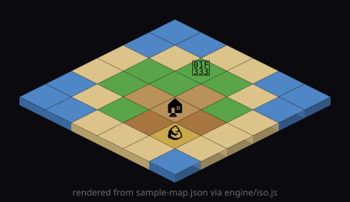

# 🗂️ Examples

## `sample-map.json`

A real, loadable map in the [`tilemap-data-format`](../skills/tilemap-data-format/SKILL.md): a 6×6 island with a `ground` tile layer and an `objects` layer (tree, house, rock).

Load it, then render with the [reference engine](../engine/iso.js):

```js
import { gridToScreen, depthSort } from "../engine/iso.js";
import map from "./sample-map.json" assert { type: "json" };

const { w, h } = map.tileSize;
const ground = map.layers.find((l) => l.name === "ground").data;
// draw tiles back-to-front, then depthSort(objects) on top
```

This is the same shape the [live demo](../demo/) builds at runtime — here it's authored by hand to prove the format is editable and engine-agnostic.

## ▶️ Render it headless (no browser)

[`render-map.mjs`](render-map.mjs) loads `sample-map.json` and draws it to SVG using the **tested** [`engine/iso.js`](../engine/iso.js) — proof the data format + math render a real scene with zero dependencies:

```bash
node examples/render-map.mjs   # -> examples/sample-map.svg
```


